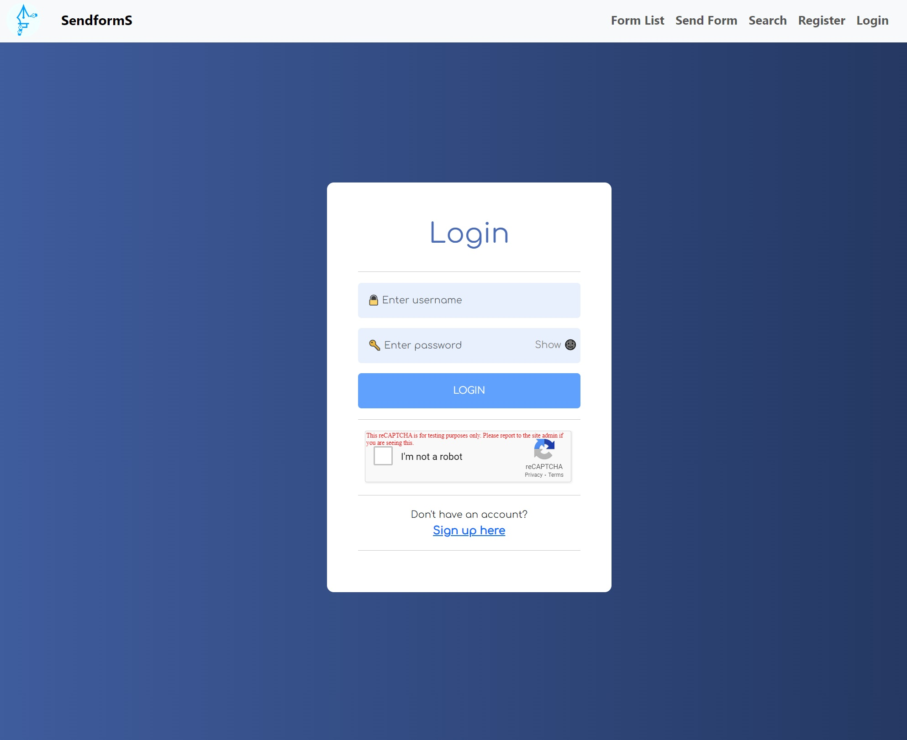
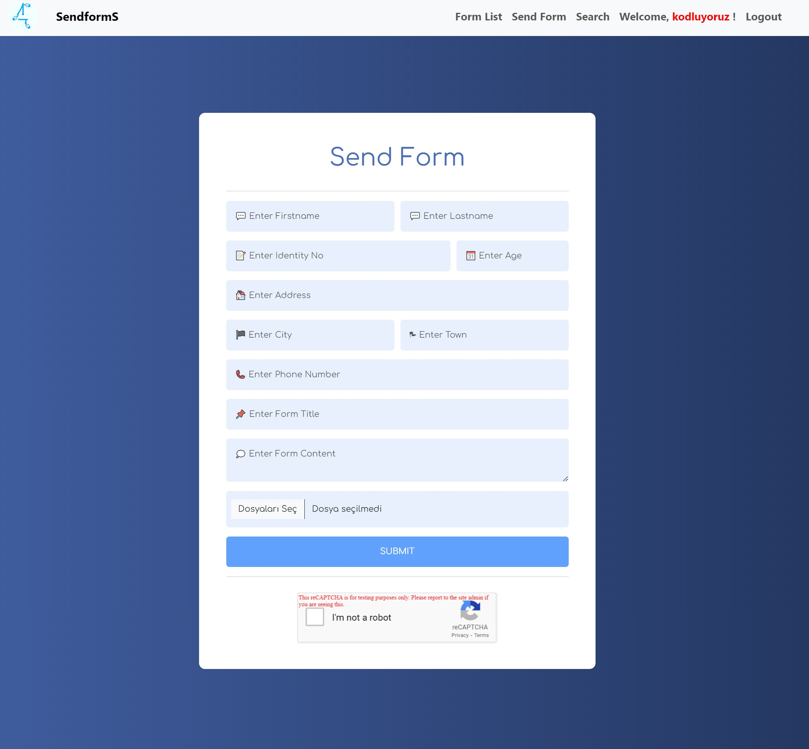
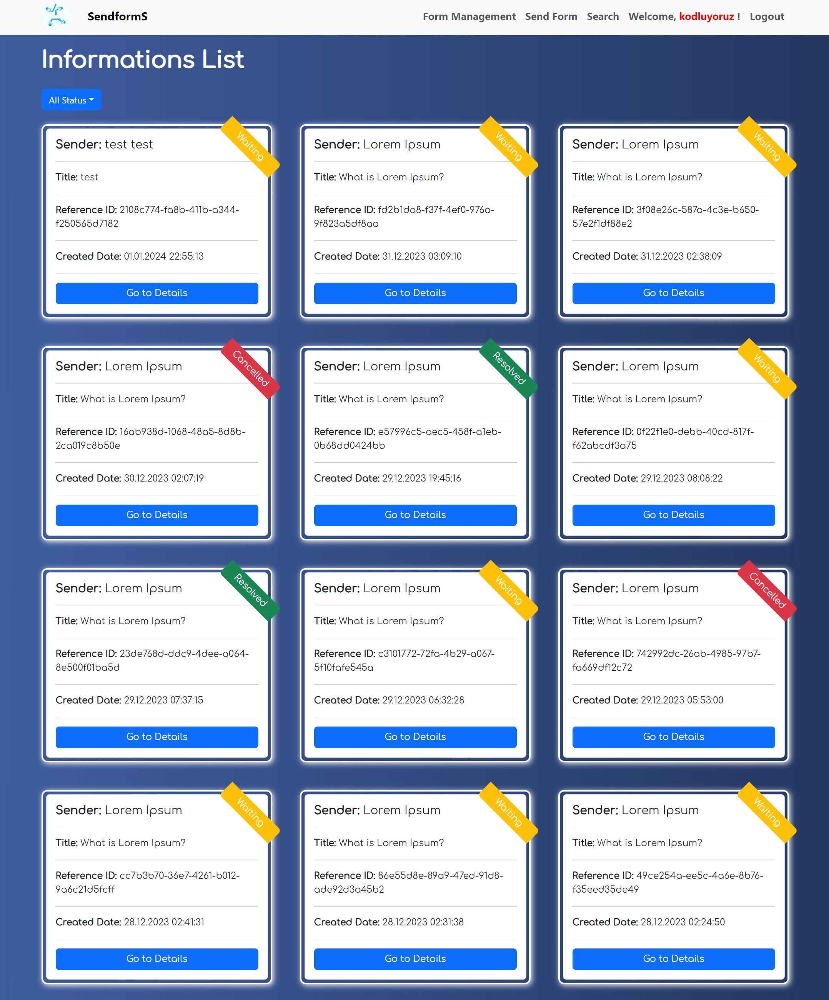
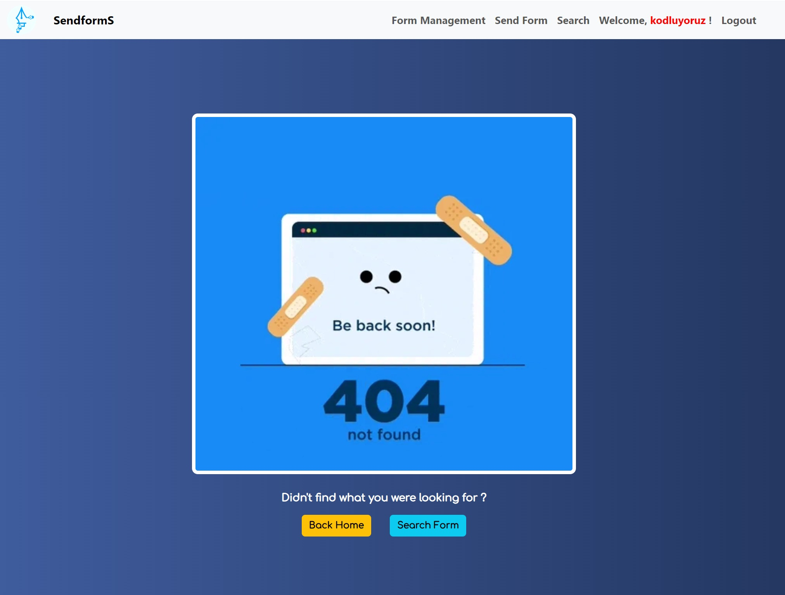

# Support Ticket Service - Frontend

This is the frontend repository of the Support Ticket Service system. It's a React-based application designed to interact with the backend to manage support form information.

This project enables both logged-in users and guest users to submit forms, expressing complaints, suggestions, or seeking support. These forms are responded to by authorized personnel, catering to various concerns outlined within them.

# Live View

https://sendform.vercel.app/

## Getting Started

To run this project locally, follow these steps:

1. Clone this repository.

2. Navigate to the frontend directory:
```
cd frontend/ticket-support
```

3. Install dependencies:
```
npm install
```

4. To run it locally with the backend, replace the 'baseURL' with 
```
http://localhost:8080/api 
```
    in 'AuthContext.jsx' in frontend/ticket-support/src/context

5. Start the development server:

```
npm start
```

This will start the server 

# Project Overview
## Technologies Used

- **React**: Frontend framework for building user interfaces.
- **Axios**: HTTP client to make requests to the backend API.
- **React-Router-Dom**: DOM bindings for React Router.
- **React-dom**: React package for DOM rendering.
- **Formik**: Library for building forms in React.
- **Yup**: JavaScript schema builder for validation.
- **Toastify**: Notification library for React applications.
- **Bootstrap**: React components for Bootstrap.
- **Google-Recaptcha**: Google reCAPTCHA integration for React.

## Folder Structure

- **src/admin**: Contains files related to administrative operations such as adminformdetail, adminformlist, and adminlogin.
- **src/context**: Manages authentication processes, extracting information like username, role, and token using JWT.
- **src/form**: Handles form-related functionalities including formdetail, formsearch, formsend, and formsuccess files.
- **src/helper**: Houses files for specific tasks such as displaying confetti on success after form submission, extracting and downloading files like jpg, pdf, and png.
- **src/layouts**: Includes header, home, notfound, and register files that define the layout of the project.
- **src/route**: Contains privateroute file defining routes with restricted access.
- **src/user**: Consists of files related to user operations like loginuser and userformlist.
- **src/style**: Holds CSS files responsible for styling elements across the project.

## What can be done in this project?

- You can create an account, log in, and log out. Each created account is automatically saved in the database with the user role.
- You can send personal details such as name, surname, identification number, age, address, phone number, form title, and content, along with attachments like PDF/JPG/PNG files. Files containing specific details, such as PDFs, JPGs, or PNGs, can only be viewed by authorized personnel. Each form you submit can be tracked with an automatically generated reference ID. If you submit a form after logging in, your username will be included in the form. You can filter through all the forms you've submitted without the need to save the reference IDs of each form separately. If you submit a form as a guest, your username will automatically be marked as 'guest', and you'll need to access your submitted forms using your reference ID.
- If logged in as a user, you can comment below your submitted form, adding additional comments about areas where you feel the description might be incomplete. Guests cannot leave comments without logging in; they are expected to log in to write comments.
- If you accidentally submit a form, you can update its status and mark it as 'Cancelled'. If your submitted form has been marked as 'Resolved' by an authorized person but you believe you haven’t received the necessary response, you can edit the form, mark it as 'Waiting for response', and await a new reply. Guests cannot edit their submitted forms. Additionally, users can only edit the 'status' of their submitted form; they cannot edit other sections.
- Your personal and private information in the submitted form is only visible to authorized personnel. Other users and guests can only see general sections of your complaint, such as the subject and content, but cannot view your personal and private details.
- Forms submitted by other users and guests can be viewed by everyone. Comments made by authorized personnel can be seen, and the status of these forms being resolved or not can be checked.
- Members cannot interact with each other. Users and guests cannot access the admin panel.
- Admins can view the complete contents of all forms, including personal information. They have full authorization to edit all form details and comments, delete forms, and comments.
- The login pages for admins and regular users differ. If an admin tries to log in from the regular user login panel, they receive a warning message and are automatically redirected to the admin login panel.
- If the URL being accessed does not exist, a 404 not found error is encountered.
Feel free to modify or add more detailed explanations if required, based on the specifics of your project or any additional context you'd like to provide.

## Routes/Paths

1. **/basvuru-olustur**
    - Public endpoint/The section where users and guests create forms.
    - Allows any user to fill out the application form.
    - The application form includes fields for [Name, Surname, Age, ID Number, Reason for Application, Address Information, Photos/Attachments, Submit] button.

2. **/basvuru-basarili (Successful application submission page)**
    - Displays a thank-you message and provides the user with an application code along with application details.

3. **/basvuru-sorgula (Query application)**
    - Displays an input field where the application code can be entered, along with a query button.

4. **/basvuru/{applicationNo} (Application details)**
    - Displays application details, its current status, and any provided response(s) if available.
    - If the application number is incorrect, a 404 (Not Found) message is displayed.

5. **/admin**
    - Displays a admin login form.

6. **/admin/basvuru-listesi (Application list for admin)**
    - After successful login, lists pending (unresolved/unanswered) applications with basic information. (Applicant, Date)
    - Each item in the application list has a "View Application" button.

7. **/admin/basvuru/{applicationNo} (Application details for admin)**
    - Allows the status of the application to be updated and enables admins to write a response to the application.
    - The response written here is visible to end users in the application/{applicationNo} section.

***Additionally, added features beyond the requested ones:***

8. **/login**
    - Endpoint for users with the 'user' role to log in.

9. **/register**
    - Registration page for creating an account.

10. **/user/basvuru-listesi**
    - Page where both guests and logged-in users can view and filter all forms submitted.

11. **/**
    - Homepage of the application.

12. **'*'**
    - 404 not found page for non-existent URLs.


Additionally, this project encompasses all the above functionalities as described. Everything requested has been implemented within this project.

# Contributing

Contributions to this project are welcome! Feel free to open issues for feature requests, bug reports, or submit pull requests.

# Acknowledgements

This project has been developed as the final project for the Patika/Fimple React Bootcamp. Rather than serving a professional purpose, it is designed for educational purposes.

# Screenshots From Project










